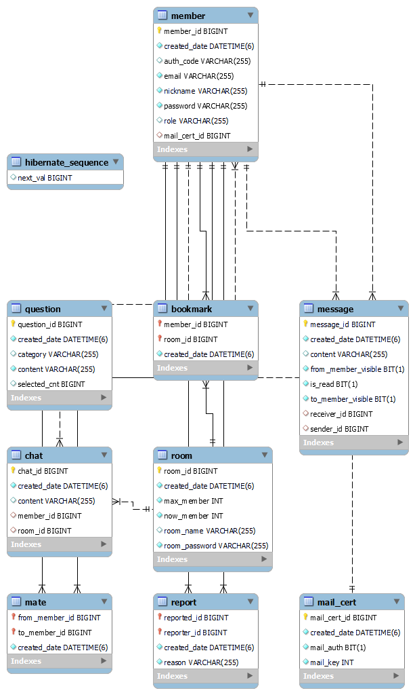
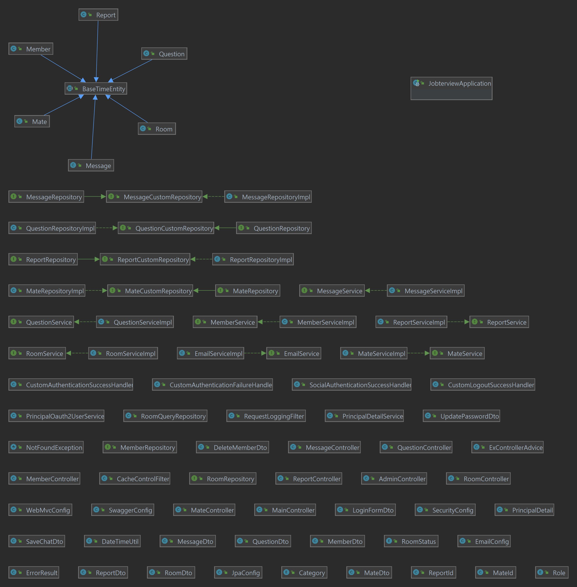

# 🍪JOB터뷰 Final 명세서

## 1. 요구사항 정의서 (Usercase Diagram) <-애 수정해야함

- 일반 게시판

  - 모든 게시글 목록 (getBoardListAll)
  - 특정 게시글 상세 (getBoardView)
  - 게시글 작성 (writeBoard)
  - 게시글 수정 (updateBoard)
  - 게시글 삭제 (deleteBoard)
     

- 회원
  - 로그인 (login)
  - 로그아웃 (logout)
  - 회원가입 (join)
  - 아이디 중복 체크 (idCheck)
  - 마이페이지 (userInfo)
  - 회원 수정 (modify)
     
- 관광지
  - 관광지 목록 (getAttractionList)
  - 관광지 상세 (getAttractionDetail)
     
- 여행계획
  - 여행계획 작성 (writePlan)
  - 여행계획 목록 (getPlanList)
  - 여행계획 상세 (getPlanDetail)
  - 여행계획 삭제 (deletePlan)

---

## 2. 테이블 구조도 (ERD)

---

## 3. Class Diagram

---

## 4. 화면 설계서 <-이거넣기

넣기

## 👪참여자 <- 이모지 변경

😺 SSAFY 9기 강수창(팀장)

😎 SSAFY 9기 정태희(부팀장)

😎 SSAFY 9기 이상우(팀원)

😎 SSAFY 9기 박대균(팀원)

😎 SSAFY 9기 유진욱(팀원)

😎 SSAFY 9기 이경호(팀원)

